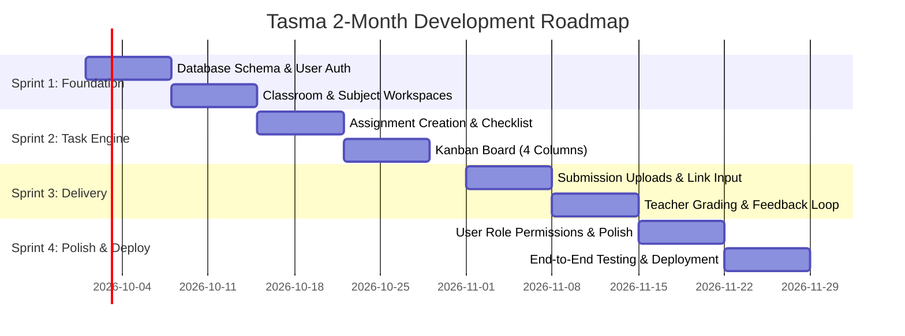

# Requirement Specification: Tasma (Jira Replicate for Student Tasks)

---

## 1. Atlassian Jira Core Features Exploration

This section analyzes the foundational features of Atlassian Jira as an enterprise project and issue tracking system, presented in the required 5-part structure.

### 1.1 Project & Workspace Management
1. **Feature name**: Project & Workspace Administration
2. **Usage**: Allows administrators and project leads to create, configure, and isolate distinct project spaces (e.g., Software Development, Service Desk, Business Projects) with unique project keys, member directories, and permissions.
3. **Input**:
   - Project Name, Project Key (e.g., `DEV`, `PROJ`), Project Category/Template (Scrum, Kanban).
   - Project Lead assignment, Default Assignee.
   - Member access list and Role-Based Access Control (RBAC) assignments.
4. **Output**:
   - A dedicated project workspace with an isolated board, backlog, issue registry, and project configuration settings.
5. **Process**:
   - System validates the uniqueness of the project name and project key.
   - Generates project database records, sets up default issue type schemes and permission schemes.
   - Initializes default Agile boards and associates invited team members with designated project roles.

### 1.2 Issue Tracking & Item Management
1. **Feature name**: Issue Lifecycle & Metadata Tracking
2. **Usage**: Used by all team members to log, document, categorize, prioritize, and track individual units of work (Epics, Stories, Tasks, Bugs, Sub-tasks).
3. **Input**:
   - Issue Type (Epic, Task, Bug, etc.), Summary/Title, Description (Rich Text/Markdown).
   - Priority (Lowest, Low, Medium, High, Highest), Due Date, Reporter, Assignee.
   - Components, Labels, Attachments, and Story Point Estimates.
4. **Output**:
   - A uniquely keyed issue ticket (e.g., `DEV-101`) viewable via detail modal or dedicated URL, complete with metadata attributes and audit history.
5. **Process**:
   - User initiates ticket creation and fills mandatory fields (Summary, Issue Type, Project).
   - System assigns auto-incremented key based on project prefix (`PROJECT_KEY-N`).
   - System registers creation timestamp, logs reporter identity, and sends notification to assignee.
   - Ticket becomes immediately searchable and visible on project backlogs and boards.

### 1.3 Agile Kanban & Scrum Boards
1. **Feature name**: Visual Agile Board Management
2. **Usage**: Provides teams with a real-time visual representation of work in progress, supporting drag-and-drop card movements across delivery stages, swimlanes, and column limits (WIP).
3. **Input**:
   - Board Configuration (Column-to-status mapping, JQL filter queries).
   - Card drag-and-drop actions, column reordering, quick filter selections (e.g., "Only My Issues").
4. **Output**:
   - Multi-column interactive visual board showing issue cards categorized into operational statuses with real-time state synchronization.
5. **Process**:
   - System evaluates the board filter query and fetches relevant issues.
   - Categorizes each ticket into its designated column based on current workflow status.
   - Upon drag-and-drop, validates transition permissions and execution rules.
   - Updates issue status in the database and broadcasts state updates to connected clients.

### 1.4 Workflow & State Transition Engine
1. **Feature name**: Workflow State Machine
2. **Usage**: Enforces business logic and operational progression for issues as they move from inception to resolution (e.g., `Backlog -> In Progress -> Code Review -> QA -> Done`).
3. **Input**:
   - Workflow schema definition (statuses, transitions, conditions, validators, post-functions).
   - Transition trigger (user clicks status change button or moves card on board).
4. **Output**:
   - Updated ticket state, execution of post-transition actions (e.g., setting resolution field, reassigning issue, updating timestamps).
5. **Process**:
   - System checks if current user has permission to execute the requested transition.
   - Executes validation rules (e.g., "Requires Fix Version", "Requires Comment").
   - Executes state mutation and runs configured post-functions (e.g., record resolution date, fire webhook event).
   - Appends entry to the issue changelog/audit trail.

### 1.5 Backlog & Sprint Planning
1. **Feature name**: Backlog Grooming & Sprint Execution
2. **Usage**: Enables Product Owners and Scrum Masters to rank issues by priority, organize them into time-boxed Sprints, commit work, and track sprint completion.
3. **Input**:
   - Sprint Name, Sprint Goal, Start Date, End Date (Sprint duration).
   - Drag-and-drop reordering of issues from backlog to active/planned sprints.
   - Story point estimation per issue.
4. **Output**:
   - Active Sprint board showing committed scope, Sprint burndown charts, and backlog pool for future iterations.
5. **Process**:
   - System aggregates unassigned issues in the backlog view sorted by rank.
   - User creates a sprint container and moves selected backlog tickets into it.
   - When user clicks "Start Sprint", system locks sprint duration, snapshots baseline story points, and activates the Sprint Kanban view.
   - Upon "Complete Sprint", completed tickets are archived and incomplete tickets are rolled over to the backlog or next sprint.

### 1.6 Issue Collaboration & Attachments
1. **Feature name**: Activity Stream, Comments & Attachments
2. **Usage**: Enables team discussion, context sharing, code/design asset uploads, and direct communication on individual tickets.
3. **Input**:
   - Comment text (with `@user` mentions and formatting).
   - File uploads (screenshots, logs, documentation files).
4. **Output**:
   - Chronological activity log showing comments, file previews/download links, and automated event logs.
5. **Process**:
   - System validates uploaded file types and sizes, storing files in object storage and linking references to the issue ID.
   - Parses comments for mention tokens (`@username`) and queues notification events.
   - Renders formatted comment and updates issue's `updated_at` timestamp.

---

## 2. Tasma Adapted Core Features (Student Task Management)

Adapted specifically for **Junior School Teachers** and **Students** based on project scope constraints (2 months timeline, 1 developer + tester, 1,000,000 VNĐ budget).

### 2.1 Classroom / Subject Workspace Management
1. **Feature name**: Classroom & Subject Workspace
2. **Usage**: Teachers create and manage virtual classroom spaces corresponding to their teaching subjects (e.g., "Grade 7 - Mathematics", "Grade 6 - Science"), providing a dedicated task hub for their enrolled students.
3. **Input**:
   - Class Name, Subject/Grade Level, Academic Term.
   - Student roster list (Student Names, Student Email/IDs).
4. **Output**:
   - Classroom dashboard listing enrolled students, active assignments, and an organized workspace.
5. **Process**:
   - Teacher creates a classroom project.
   - System generates classroom profile and enrollment association.
   - Enrolled students automatically see the classroom workspace in their student portal.

### 2.2 Student Task & Assignment Management
1. **Feature name**: Assignment & Student Task Creation
2. **Usage**: Teachers create structured homework, assignments, and group projects; students break down assignments into actionable sub-tasks.
3. **Input**:
   - Task Title, Instructions/Description, Subject Tag.
   - Due Date & Due Time, Priority Level (Low, Medium, High).
   - Target Assignee(s) (Individual student, student group, or entire class).
   - Sub-task checklist items (e.g., "1. Read Chapter 4", "2. Complete exercises 1-5").
4. **Output**:
   - Interactive assignment cards distributed to the assigned students' boards.
5. **Process**:
   - Teacher inputs assignment details and selects target students.
   - System creates task records linked to the classroom and assigned student IDs.
   - Student view renders the new task with its instructions, deadline counter, and sub-task checklist.
   - Students can check off sub-task items as they complete each step.

### 2.3 Educational Kanban Board
1. **Feature name**: Educational 4-Stage Kanban Board
2. **Usage**: Visual board representing the educational lifecycle of assignments, tailored to junior school workflows.
   - Columns:
     1. **To Do (Assigned)**: Newly posted homework/tasks.
     2. **In Progress**: Tasks actively being worked on by the student.
     3. **Submitted (Under Review)**: Tasks handed in by the student awaiting teacher evaluation.
     4. **Done (Graded/Completed)**: Tasks reviewed and finalized with teacher score/feedback.
3. **Input**:
   - Drag-and-drop card movements between columns.
   - Filter criteria (filter by Subject, Priority, or Due Date).
4. **Output**:
   - Visual multi-column board reflecting current completion state of all tasks for students and teachers.
5. **Process**:
   - Board loads tasks matching user role (students see their own tasks; teachers can view all class tasks or filter by student).
   - Student drags card from "To Do" to "In Progress" when starting work.
   - When student moves card to "Submitted", system enforces that submission content or confirmation is provided.
   - Only the teacher has authorization to move a task from "Submitted" to "Done (Graded)" or return it to "In Progress" for corrections.

### 2.4 Task Submission & Student Work Delivery
1. **Feature name**: Homework Submission & Attachment Delivery
2. **Usage**: Enables junior school students to hand in their homework directly within the task card before the deadline.
3. **Input**:
   - Student submission note/summary.
   - External document link (e.g., Google Docs, Google Drive, Canva presentation link).
   - Optional file attachment (photo of handwritten work, PDF, document up to 5MB).
4. **Output**:
   - Submission package attached to the task card, status updated to "Submitted", with submission timestamp recorded.
5. **Process**:
   - Student opens task card in "In Progress" state and clicks "Submit Work".
   - Student attaches link or file and enters optional notes.
   - System uploads file to lightweight storage, records submission timestamp, and shifts task to "Submitted".
   - System flags if submission is on-time or late relative to the task's due date.

### 2.5 Teacher Evaluation & Feedback (Grading)
1. **Feature name**: Task Grading & Feedback Evaluation
2. **Usage**: Enables teachers to inspect submitted student work, provide qualitative remarks, assign numerical or letter grades, and finalize task completion.
3. **Input**:
   - Score / Grade (e.g., scale 0–10 or 0–100).
   - Qualitative Feedback / Comments (e.g., "Good effort, check question 3 again").
   - Action: "Approve & Mark Done" OR "Return for Revision".
4. **Output**:
   - Graded task moved to "Done (Graded)" column, or returned to "In Progress" with revision notes; feedback visible to the student.
5. **Process**:
   - Teacher selects a task in the "Submitted" column and reviews student attachments/links.
   - Teacher inputs score and feedback comments.
   - If approved: System records grade, stamps evaluator ID, and shifts task status to "Done".
   - If returned for revision: System updates status back to "In Progress" and marks task with a "Revision Requested" badge so the student knows to update their work.

---

## 3. Stakeholders & User Roles

| Stakeholder | Role in Project | Key Responsibilities & Permissions |
| :--- | :--- | :--- |
| **Project Manager** | Product & Delivery Lead | - Oversees 2-month development timeline and sprint schedule. - Ensures project adheres to the 1,000,000 VNĐ budget. - Manages scope control and approves deliverable milestones. |
| **Developer (+ Tester)** | Sole Software Engineer | - Responsible for full-stack architecture, database design, and UI/UX. - Implements core Kanban, task lifecycle, and submission modules. - Performs manual functional testing, cross-browser verification, and deployment. |
| **Customer: Junior School Teacher** | Primary User & Domain Expert | - Creates classrooms and registers student rosters. - Creates assignments with instructions, checklists, and due dates. - Reviews submitted work, issues grades, and provides constructive feedback. |
| **End-User: Student** | Secondary User (Learner) | - Accesses assigned tasks through personalized board. - Tracks progress using sub-task checklists and moves tasks across columns. - Submits assignment files/links and reads teacher grading feedback. |

---

## 4. Estimated Costs & Resource Breakdown

### 4.1 Budget Allocation (Total: 1,000,000 VNĐ)
The total budget is capped at 1,000,000 VNĐ (~$40 USD). Cost efficiency is achieved by using cloud free tiers:

| Expense Item | Provider / Service | Cost (VNĐ) | Notes |
| :--- | :--- | :--- | :--- |
| **Domain Name** | Custom domain (.com / .xyz / .edu.vn sub-domain) | ~250,000 – 350,000 | Annual registration for professional web access |
| **Web Hosting & Compute** | Vercel / Render / Netlify Free Tier | 0 | Free tier includes generous bandwidth and build minutes |
| **Database & Auth** | Supabase / Neon / PostgreSQL Free Tier | 0 | Free tier covers 500MB database, auth, and connection pooling |
| **File Storage** | Cloudflare R2 / Supabase Storage Free Tier | 0 | Free tier covers up to 1GB–5GB of homework uploads |
| **Contingency / Development Assets** | UI icons, fonts, domain DNS, reserve | ~650,000 – 750,000 | Reserved for operational contingency or minor utility costs |
| **Total** | | **1,000,000 VNĐ** | **100% within budget** |

### 4.2 Engineering Timeline: 2-Month Roadmap (1 Member Team)

- **Month 1 (Weeks 1–4)**:
  - **Sprint 1 (Weeks 1–2)**: Project foundation, authentication (Teacher vs Student roles), and Classroom/Subject workspace management.
  - **Sprint 2 (Weeks 3–4)**: Assignment management (creation, due dates, sub-task checklists) and the core 4-column Educational Kanban Board.
- **Month 2 (Weeks 5–8)**:
  - **Sprint 3 (Weeks 5–6)**: Student submission flow (attachments, links, notes) and Teacher Grading/Feedback loop (scoring, revision requests).
  - **Sprint 4 (Weeks 7–8)**: Role security checks, responsive UI polish, end-to-end user testing with junior school classroom sample data, and production deployment on custom domain.